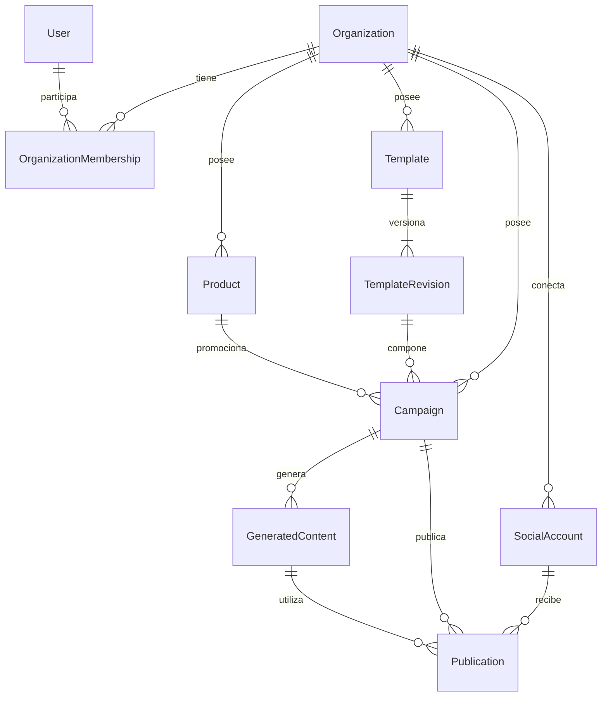
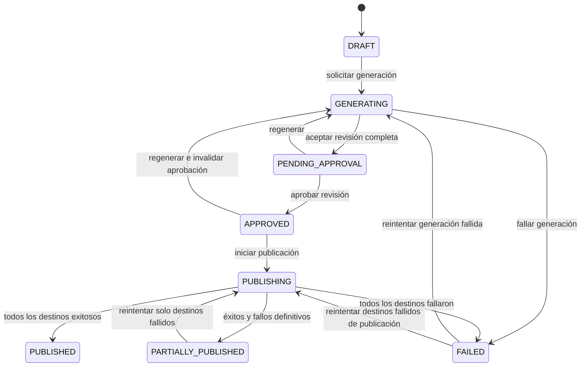

# Modelo de dominio: fase 2

Estado: los cuatro incrementos de la fase 2 están implementados e integrados: base comercial, plantillas, campañas y resultados por destino. Actualizado el 20 de septiembre de 2026. Detalle de cambios y verificaciones en [base comercial](phase-2.md), [plantillas](phase-2-templates.md), [campañas](phase-2-campaigns.md) y [publicaciones](phase-2-publications.md). La fase 3 tiene [persistencia comercial](phase-3-commercial.md) integrada y [persistencia de campañas](phase-3-campaigns.md) implementada; publicaciones e intentos quedan pendientes.

Referencias: [arquitectura](../architecture.md), [fase 2 y fases siguientes](../fases1-4.5.md), [integraciones y seguridad](../fases5-10.md) y [validación de la fase 1](phase-1.md). Este documento concreta el modelo de negocio; las reglas generales de arquitectura siguen en su referencia original.

## Punto de partida

Al iniciar la propuesta, la API contenía `AppModule`, configuración de arranque y `HealthController`, sin módulos de negocio, entidades de dominio, contratos de repositorio ni Prisma. El incremento 1 agregó organizaciones y catálogo en dominio y aplicación. Vitest descubre archivos `*.spec.ts`, y la API usa TypeScript con ESM. El CMS mantiene la pantalla inicial de Next.js y un endpoint de salud. Docker y los healthchecks de la fase 1 ya fueron verificados.

La fase 2 puede incorporarse bajo `apps/api/src/modules` sin reorganizar el código de arranque. Las clases de aplicación serán TypeScript puro, instanciables directamente en pruebas. No hace falta registrar módulos NestJS para probarlas.

## Supuestos de producto propuestos

El catálogo común y la moneda explícita sustentan el incremento 1 autorizado. Los supuestos sobre campañas, usuarios y publicación delimitan los incrementos siguientes:

1. Una campaña promociona un único elemento del catálogo y usa una versión de plantilla. Las campañas con varios productos quedan para una ampliación concreta.
2. Cada dato de negocio pertenece a una organización. Un usuario podrá pertenecer a varias organizaciones mediante membresías; no se implementa todavía autenticación.
3. Productos y servicios comparten inicialmente los datos necesarios para publicidad: nombre, descripción, precio y material visual. Se propone un solo catálogo con un discriminador `ProductKind.PRODUCT | SERVICE`.
4. La moneda se indica explícitamente. No se asume una moneda por la ubicación del equipo ni se hacen conversiones automáticas.
5. La aprobación autoriza una revisión exacta del contenido y sus destinos. Cambiar esa revisión exige otra aprobación. No se permiten cambios mientras una publicación está en curso ni después de publicarse.

## Módulos, entidades y responsabilidades

Los siguientes son límites lógicos dentro de un monolito modular, no servicios desplegados por separado. Una raíz de agregado es la entidad que protege un conjunto de reglas que deben mantenerse consistentes al modificarlo.

| Módulo            | Modelo principal                                                     | Responsabilidad y límites                                                                                                                              |
| ----------------- | -------------------------------------------------------------------- | ------------------------------------------------------------------------------------------------------------------------------------------------------ |
| `organizations`   | `Organization`                                                       | Identidad de la empresa, nombre comercial y perfil de marca. No contiene colecciones de campañas ni usuarios.                                          |
| `users`           | `User`; `OrganizationMembership` como relación con identidad propia  | Identidad personal y pertenencia a organizaciones. El rol pertenece a la membresía. Login, sesiones y aplicación de permisos corresponden a la fase 9. |
| `products`        | `Product`, raíz del catálogo                                         | Datos comerciales de un producto o servicio, precio base y referencias de imágenes. No administra inventario, reservas ni facturación.                 |
| `templates`       | `Template`, con revisiones inmutables `TemplateRevision`             | Identidad de una plantilla, dimensiones y versión de la composición. HTML/CSS y su ejecución segura se incorporan en la fase 6.                        |
| `campaigns`       | `Campaign`, raíz; `GeneratedContent` para cada revisión de contenido | Brief, oferta, generación, revisión y autorización de publicación. Es propietario del contenido generado; no hace llamadas a proveedores.              |
| `social-accounts` | `SocialAccount`                                                      | Destino externo, plataforma, organización y estado de conexión. Los tokens se gestionan mediante infraestructura segura en fases posteriores.          |
| `publications`    | `Publication`, una raíz por destino de una campaña                   | Resultado independiente, intentos y referencia de publicación externa. No modifica el contenido aprobado ni contiene clientes de redes sociales.       |

No se propone un módulo independiente de `generated-contents`: su ciclo de vida pertenece a campañas. Tampoco un agregado que cargue toda la organización o todos los intentos históricos al modificar una campaña.

## Relaciones por identidad



El diagrama representa relaciones de negocio, no imports entre entidades ni un schema de Prisma. Por ejemplo, `Campaign` conserva `organizationId`, `productId`, `templateId` y `templateRevisionId`; no recibe una instancia de `Product` o `Template`.

Todas las referencias de una campaña deben pertenecer a su organización. Los casos de uso comprueban existencia y pertenencia mediante contratos. Las consultas y escrituras de repositorio reciben `organizationId` además del identificador del recurso. Esto prepara el aislamiento de datos, pero no sustituye la autorización de usuarios que se implementará en la fase 9.

## Datos y comportamiento de cada entidad

### Organization y catálogo

`Organization`: UUID, nombre comercial, descripción y perfil de marca opcional —tono y referencia del logo—, además de fechas de creación y modificación. Su comportamiento inicial permite cambiar el nombre y actualizar el perfil; rechaza nombres vacíos. No exige un logo para crear una empresa.

`Product`: UUID, `organizationId`, tipo, nombre, descripción, `regularPrice` y referencias opcionales de imágenes. Permite actualizar datos y cambiar el precio validando sus reglas. Las referencias de archivos son identificadores estables; no se guardan URLs firmadas que puedan caducar.

La promoción pertenece a la campaña. Si dos campañas ofrecen el mismo producto con distintos precios o fechas, ninguna modifica el precio base del catálogo.

### Template

`Template` mantiene identidad, organización, nombre y referencia de la revisión vigente. `TemplateRevision` conserva un número de revisión, dimensiones y la definición de composición cuando esta se implemente. Cambiar una plantilla crea una revisión nueva; las campañas existentes siguen apuntando a la anterior.

En fase 2 se valida la identidad y el formato inicial de 1080 × 1080. El modelo de dimensiones podrá representar otros tamaños, pero el soporte del renderer se amplía en la fase 6. No se admite HTML arbitrario ni se crea un motor de plantillas en esta fase.

El incremento 2 implementa `CreateTemplate`, que consulta la existencia de la organización mediante un port propio y solicita al repositorio insertar la plantilla junto con su revisión inicial de forma atómica. `Template.createRevision` produce una nueva versión del agregado con otra revisión, conservando intactas las referencias anteriores. El agregado mantiene solo la revisión vigente; la conservación del historial y la unicidad de IDs/números en almacenamiento se implementarán con persistencia. No hay todavía caso de uso de edición ni renderer.

### Campaign y GeneratedContent

`Campaign` mantiene:

- Identidad, organización, título, producto y revisión de plantilla.
- Brief: instrucciones, llamada a la acción y oferta opcional.
- Estado, identificador de la generación vigente y referencias a contenido candidato y aprobado.
- Destinos aprobados por `socialAccountId` y resumen de publicaciones por identidad y versión.
- Fechas y versión para controlar modificaciones concurrentes en persistencia.

Comportamiento implementado: `requestGeneration`, `recordGeneratedContent`, `recordGenerationFailure`, `approve`, `requestRegeneration`, `startPublication`, `recordPublicationSummary` y `retryPublication`. Cada operación expresa una transición concreta; no hay un `setStatus` público.

`GeneratedContent` es una revisión identificada e inmutable de la campaña. Conserva la entrada comercial utilizada —snapshot de producto, oferta, marca y versión de plantilla— y el resultado: titular, caption, CTA, hashtags y referencias de assets según avance la generación. Un resultado incompleto no puede ser el candidato aprobable. El prompt creativo se incorpora cuando exista generación de imágenes.

El historial puede persistirse y consultarse por separado. Para aprobar no es necesario cargar todas las revisiones: se carga la candidata, se verifica que pertenece a esa campaña y organización, y se conserva su identificador como `approvedContentId`. La escritura de la revisión aceptada y la actualización de la campaña deben ser atómicas al añadir persistencia.

La aprobación se aplica al contenido final mostrado al usuario, incluidos los datos comerciales exactos y los destinos elegidos. Editar el catálogo no cambia retroactivamente una revisión. Si el usuario quiere incorporar esos cambios, solicita una nueva generación o revisión y vuelve a aprobarla.

La aprobación exige el ID exacto del contenido candidato. Desde el incremento 4, `Campaign.approve` también puede fijar un conjunto de cuentas destino, sin duplicados; una aprobación sin destinos permite revisar contenido, pero no iniciar publicación. El caso de uso existente `ApproveCampaign` conserva su alcance de aprobación de contenido: incorporar selección de cuentas a aplicación requerirá comprobar existencia, pertenencia y conexión mediante un port al integrar cuentas sociales.

Solicitar generación o regeneración captura producto, oferta, marca, brief y revisión de plantilla mediante `GenerationSnapshot`. Los callbacks utilizan esa copia almacenada, sin aceptar otra entrada comercial. Un resultado completo requiere titular, caption, CTA coincidente con el brief y al menos una referencia de asset; los hashtags pueden estar vacíos. La existencia y contenido real de los archivos se comprobarán al integrar almacenamiento y renderizado. Las nuevas generaciones invalidan la aprobación y sus destinos y deben conservar el historial mediante el contrato de repositorio.

### SocialAccount y Publication

`SocialAccount` conserva UUID, organización, plataforma, identificador externo, nombre visible y estado de conexión. Una misma organización puede tener varias cuentas de una plataforma. El destino es la cuenta concreta, no solo el nombre de la red. Los detalles de OAuth y la referencia segura de credenciales se concretan en la fase 8.

`Publication` conserva UUID, organización, campaña, revisión aprobada, cuenta destino, plataforma, estado y versión. El incremento 4 incorpora el intento vigente con ID, número y fecha; identificador externo del resultado; fecha de publicación y código de fallo confirmado. El historial de intentos y su persistencia, las URLs externas y los adapters se concretarán en sus fases.

La raíz permite iniciar un intento, registrar éxito o registrar fallo sin afectar a las publicaciones de otras cuentas. Una publicación exitosa es terminal. Repetir la misma confirmación de éxito es inocuo; una confirmación contradictoria se rechaza. Un resultado tardío de un intento anterior no puede sobrescribir uno vigente.

`PublicationProgress`, objeto de valor de campañas, recibe datos planos mediante el contrato consumidor `CampaignPublication`. Exige un resumen completo de las publicaciones fijadas al iniciar, verifica organización/campaña/revisión/cuenta, rechaza versiones anteriores y estados contradictorios, y conserva las publicaciones exitosas al reintentar. El estado detallado pertenece a `Publication`; el resumen no importa esa entidad ni sustituye su persistencia. Ambos módulos comparten solo el vocabulario pequeño `PublicationStatus` en el dominio común.

## Objetos de valor que aportan reglas

| Objeto                 | Regla y ubicación propuesta                                                                                                                                                                                                                             |
| ---------------------- | ------------------------------------------------------------------------------------------------------------------------------------------------------------------------------------------------------------------------------------------------------- |
| `Money`                | Importe entero seguro en unidades menores, no negativo, y moneda explícita de un conjunto soportado. Las comparaciones exigen igual moneda. El conjunto y la precisión por moneda se concretan al implementarlo; no se asumen dos decimales para todas. |
| `Promotion`            | Precio promocional en la moneda del precio base, inferior al base cuando se anuncia descuento, y fin opcional posterior al inicio si ambos existen. Pertenece a campañas.                                                                               |
| `TemplateDimensions`   | Ancho y alto enteros positivos. Pertenece a plantillas; la compatibilidad de formatos del renderer se valida por separado.                                                                                                                              |
| Snapshot de generación | Copia inmutable de los datos comerciales y referencias de versión usadas para generar. Pertenece a campañas.                                                                                                                                            |

`Money` tiene una regla compartida real entre catálogo y campañas: se propone en `apps/api/src/domain/value-objects/money.ts`. Ese será un contrato interno pequeño y explícito, sin mover el dominio a `packages/shared`. Los demás objetos permanecen en su módulo.

Los UUID se representan inicialmente con tipos nominales de TypeScript y validación al construir entidades, sin una clase por cada identificador. Los instantes se suministran explícitamente para probar vencimientos y transiciones sin depender de la hora real. Se evitan clases genéricas `BaseEntity` y `BaseRepository`.

## Ciclo de vida de campañas

Se implementan `DRAFT`, `GENERATING`, `PENDING_APPROVAL`, `APPROVED`, `PUBLISHING`, `PUBLISHED`, `PARTIALLY_PUBLISHED` y `FAILED`. `CampaignFailureOrigin` distingue `GENERATION` y `PUBLICATION`; los fallos parciales terminados también indican origen de publicación. Cada raíz conserva códigos controlados, sin mensajes libres del proveedor. Las siguientes transiciones son reglas puras del dominio; no ejecutan envíos:



Reglas que acompañan al diagrama:

1. La creación produce `DRAFT`; una solicitud de generación inicia una operación identificada y congela la entrada comercial que utilizará. Esa entrada se conserva al registrar la revisión, sin volver a leer precios o marca mutables durante la generación. No se acepta una segunda solicitud mientras esa operación siga activa.
2. Solo el resultado completo de la generación vigente puede llevar a `PENDING_APPROVAL`. Los callbacks duplicados no crean otra revisión y los antiguos no reemplazan a la vigente.
3. Solo se aprueba desde `PENDING_APPROVAL`, con una revisión completa de esa campaña. El actor de la aprobación se incorporará con identidad autenticada en la fase 9.
4. La primera publicación empieza únicamente desde `APPROVED`, con una revisión y al menos un destino fijados. Si la oferta tiene vencimiento, se verifica antes del envío.
5. `FAILED` conserva el origen del fallo (`GENERATION` o `PUBLICATION`). Cada reintento tiene una operación específica y verifica ese origen: un fallo de generación no habilita publicación.
6. Reintentar publicación reutiliza la autorización y revisión originales, solo afecta a destinos fallidos y vuelve a comprobar la vigencia comercial. No permite aprobar o enviar contenido nuevo desde `FAILED`.
7. Mientras quede un destino pendiente o en curso, la campaña permanece en `PUBLISHING`. `PARTIALLY_PUBLISHED` representa un resultado mixto ya terminado, no una operación todavía en progreso.
8. `PUBLISHED` es terminal para la campaña. Repetir la promoción requiere crear otra campaña explícitamente.

Se implementa `GENERATING` como estado de negocio en lugar de exponer `GENERATING_COPY` y `GENERATING_IMAGE` del ejemplo arquitectónico. El paso técnico será progreso de la operación de generación cuando se implemente: evita acoplar aprobación/publicación al orden de n8n.

Se implementa `PARTIALLY_PUBLISHED`: un único `FAILED` ocultaría que algunas redes ya publicaron. El detalle por destino siempre pertenece a `Publication` y prevalece sobre el resumen de campaña.

## Publicación, concurrencia e idempotencia

Cada publicación tiene su ciclo `PENDING → PUBLISHING → PUBLISHED | FAILED`. Reintentar un fallo recuperable vuelve a `PUBLISHING` manteniendo la identidad de la publicación; no crea otra publicación lógica.

La campaña inicia con una publicación nueva en `PENDING` por cada cuenta aprobada. Mientras quede un destino pendiente o en curso, permanece en `PUBLISHING`. Cuando todos terminan, resume éxito total, parcial o fallo total. `retryPublication` exige una versión más reciente en `PUBLISHING` para cada destino fallido, preservando exactamente los destinos exitosos y la revisión autorizada. Una implementación coordinadora deberá reservar esos intentos y actualizar el resumen de forma consistente; estas operaciones puras no escriben por sí mismas en almacenamiento.

La clave lógica propuesta es `(organizationId, campaignId, approvedContentId, socialAccountId)`. En la fase 3 se respaldará con una restricción única y escrituras condicionadas por versión/estado. Una comprobación en memoria no evita que dos workers lean simultáneamente `APPROVED`.

En fases 7–8, la reserva del intento, la clave estable que se envía al proveedor y el tratamiento de callbacks se integrarán con persistencia. Un timeout después del envío puede significar que la red publicó aunque no recibimos respuesta. Ese resultado requiere reconciliación antes de reintentar; se propone un estado adicional `RECONCILIATION_REQUIRED` cuando se implementen los adapters. No se promete entrega exactamente una vez basándose solo en el estado de la entidad.

Las llamadas de red no se mantendrán dentro de una transacción SQL. Si al integrar n8n hace falta entrega durable entre el cambio de estado y el envío, se evaluará allí un outbox; no se agrega en fase 2.

## Dependencias y casos de uso

Dentro de cada módulo, el caso de uso depende de su contrato de repositorio y de las entidades que modifica. Para leer información de otro módulo usa un port del consumidor, con datos mínimos; nunca importa sus entidades o repositorios internos.

Ejemplo: `CreateCampaign` usa `CampaignRepository` y contratos de consulta para comprobar organización, producto y plantilla. Esos contratos retornan identidad, pertenencia y los datos necesarios para construir el brief. La implementación de los bridges entre módulos llegará al componer infraestructura, sin cadenas de servicios que solo deleguen.

Dependencias previstas:

- Organizaciones no dependen de campañas, catálogo o publicaciones.
- Catálogo y plantillas requieren validar la organización mediante un contrato de lectura.
- Campañas leen organización, catálogo, plantilla y, cuando corresponda, destinos sociales mediante ports.
- Publicaciones reciben la revisión autorizada y el destino como datos. Un caso de uso coordinador en campañas resume los resultados mediante un port de publicaciones; las entidades de publicaciones no llaman a campañas. Así no aparece un ciclo de imports.
- Usuarios y membresías se incorporan al validar identidad y permisos en la fase correspondiente.

Errores explícitos: `OrganizationNotFoundError`, `ProductNotFoundError`, `TemplateNotFoundError`, `CampaignNotFoundError`, `InvalidCampaignTransitionError`, `IncompleteGeneratedContentError`, `StaleGenerationResultError`, `PromotionExpiredError` y `ConcurrentCampaignModificationError`, según se implementen sus reglas. La respuesta HTTP queda para presentation; no habrá códigos HTTP en estas clases.

## Alcance recomendado de implementación de fase 2

El trabajo se divide en incrementos revisables. Los cuatro incrementos están implementados; se conserva esta tabla como delimitación del alcance de la fase.

| Incremento                | Dominio y aplicación                                                                                                                                                                                                                                           | Verificación principal                                                                                 |
| ------------------------- | -------------------------------------------------------------------------------------------------------------------------------------------------------------------------------------------------------------------------------------------------------------- | ------------------------------------------------------------------------------------------------------ |
| 1. Base comercial         | `Organization`, `Product`, `Money`, sus contratos de repositorio; `CreateOrganization`, `UpdateOrganizationProfile`, `CreateProduct` y `UpdateProduct`                                                                                                         | Reglas de importes, nombres, pertenencia y conservación de identidad                                   |
| 2. Plantillas             | `Template`, identidad de revisión, dimensiones y repositorio; `CreateTemplate`                                                                                                                                                                                 | Formato inicial y referencias de revisión estables                                                     |
| 3. Campañas               | `Campaign`, `Promotion`, revisión candidata y snapshot; repositorio y ports mínimos de consulta; `CreateCampaign`, `RequestCampaignGeneration`, `RecordGeneratedCampaign`, `RecordCampaignGenerationFailure`, `ApproveCampaign`, `RequestCampaignRegeneration` | Transiciones válidas e inválidas, revisión aprobada, callbacks antiguos y aislamiento por organización |
| 4. Resultados por destino | Entidad `Publication` y reglas puras de inicio, resultado y resumen de campaña                                                                                                                                                                                 | Éxito parcial, reintentos que preservan éxitos y bloqueo de republicación                              |

En esta fase, solicitar generación registra la intención y su identificador; no llama a n8n ni produce contenido simulado para usuarios. Registrar el resultado recibe datos estructurados suministrados por la prueba. Las operaciones no se expondrán por HTTP antes de tener una implementación real o un contrato de disponibilidad explícito en su fase correspondiente.

El incremento 4 implementa las reglas de las entidades y sus pruebas; la coordinación persistente y los casos de uso de envío real se incorporarán en las fases 7–8. Usuarios, membresías y cuentas sociales quedan definidos conceptualmente, sin crear CRUD, repositorios vacíos ni implementaciones de autenticación en fase 2.

Organización prevista de un módulo, creando solo los directorios utilizados:

```text
apps/api/src/
  domain/value-objects/money.ts
  modules/
    campaigns/
      domain/
        entities/
        value-objects/
        repositories/
        errors/
      application/
        use-cases/
        ports/
        dto/
```

Las pruebas se colocan junto al comportamiento que verifican. Repositorios y ports se sustituyen por fakes acotados dentro de las pruebas; no se crean implementaciones en memoria para producción. Las futuras carpetas `infrastructure` y `presentation` aparecen cuando se trabajen sus fases.

## Decisiones y alternativas

| Problema                                                       | Propuesta y motivo                                                                                    | Alternativa que se aplaza                                                                                                                                                                                                 |
| -------------------------------------------------------------- | ----------------------------------------------------------------------------------------------------- | ------------------------------------------------------------------------------------------------------------------------------------------------------------------------------------------------------------------------- |
| Producto y servicio necesitan la misma información promocional | Catálogo común con `ProductKind`, evitando duplicar casos de uso y rutas para el mismo comportamiento | Módulo `services` independiente si aparecen reglas de reservas, duración o prestación. La guía general menciona una tabla `services`; su separación se revisará antes del schema, no se asume obligatoria por adelantado. |
| Una edición de precio o plantilla puede alterar lo aprobado    | Snapshot comercial y revisiones inmutables; la publicación apunta a la revisión aprobada              | Consultar siempre los valores actuales, que haría posible publicar algo distinto de la vista previa aprobada.                                                                                                             |
| Una organización puede tener muchas campañas y cuentas         | Raíces separadas relacionadas por ID                                                                  | Un agregado Organization que cargue y modifique todo su contenido, con transacciones y lecturas innecesarias.                                                                                                             |
| Un proveedor falla mientras otros publican                     | Publicación por cuenta y resumen parcial en campaña                                                   | Un único resultado global, que perdería información y facilitaría envíos duplicados.                                                                                                                                      |
| El flujo de generación puede cambiar                           | Estado de negocio `GENERATING` y progreso técnico separado cuando exista integración                  | Acoplar la máquina de estados de Campaign a cada nodo de n8n.                                                                                                                                                             |
| `Money` se usa en catálogo y campañas                          | Un objeto de valor interno compartido por necesidad concreta                                          | Duplicar reglas de dinero o crear desde ahora un paquete genérico de dominio compartido con el frontend.                                                                                                                  |

## Criterios de aceptación y próximos pasos

La implementación conserva los supuestos de una oferta por campaña, catálogo común de productos/servicios y aprobación de revisiones inmutables. No se agregaron dependencias.

Los tests demuestran: inicio en borrador; rechazo de aprobación prematura; generación vigente y contenido completo; invalidación de aprobación tras regenerar; precio/moneda y vencimiento válidos; rechazo de referencias de otra organización; independencia de destinos; y bloqueo de un nuevo inicio para una campaña/publicación exitosa. Los tests de concurrencia real y constraints corresponden a persistencia, no se simulan como una garantía del dominio puro.

Los incrementos 1–3 tienen entidades, casos de uso, contratos y pruebas unitarias; el incremento 4 completa las reglas de publicaciones y resumen de campaña con sus pruebas. La fase 3 añade [persistencia comercial](phase-3-commercial.md) y [campañas con snapshots e historial](phase-3-campaigns.md), sin endpoints de negocio. Después de revisar la persistencia de campañas corresponde persistir publicaciones e intentos. Los casos de uso de envío real, las cuentas sociales y la autorización conservan las fases indicadas arriba.
